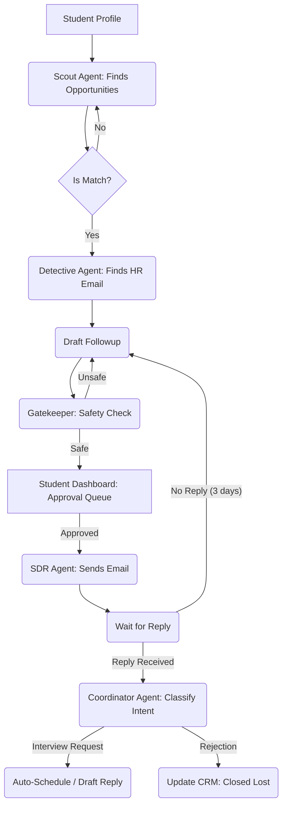

This is a comprehensive architectural and strategic blueprint for **"InternAgent"** (placeholder name). This document moves beyond the concept phase into a concrete execution strategy, focusing on technical feasibility, ethical compliance, and market differentiation.

---

# A. Validate & Expand the Problem Space

### Top 10 Student Pain Points (The "Why")
1.  **The "Black Hole" Effect:** 75% of resumes submitted via standard portals (LinkedIn, Workday) are never read by a human due to ATS filtering.
2.  **Context Switching Fatigue:** Students lose hours switching between "Hunter" mode (finding jobs) and "Writer" mode (tailoring cover letters), leading to generic, low-quality applications.
3.  **The Hidden Job Market:** It is estimated that 70-80% of jobs are not published on major boards but filled via networking or referrals. Students lack the network to access this.
4.  **Lack of Direct Access:** Students cannot find the *right* person. They apply to `careers@company.com` instead of the Engineering Manager or Campus Recruiter.
5.  **Follow-up Anxiety:** Students rarely follow up due to fear of being annoying, yet 60% of placements happen after the 2nd or 3rd touchpoint.
6.  **Generic Outreach:** Students send "Dear Hiring Manager" bulk emails. Personalized emails have a 6x higher reply rate, but take too long to write manually.
7.  **Scattered Tracking:** Managing applications across spreadsheets, emails, and portals leads to missed interviews and double-booking.
8.  **Skill-Gap Blindness:** Students apply to roles they are 50% qualified for without realizing it. They need an agent to bridge the gap or filter realistically.
9.  **Imposter Syndrome Delay:** Students waste time "perfecting" resumes rather than shipping applications.
10. **Geographic/Visa Constraints:** Filtering for "Visa Sponsorship" or specific distinct locations is manual and prone to error on standard boards.

### Failures of Existing Platforms
*   **LinkedIn:** Optimized for professionals with history, not students with potential. Highly competitive; one click apply = high noise.
*   **Internshala/Naukri:** plagued by low-quality internships, unpaid labor, and scams.
*   **University TPOs:** Limited to partner companies; highly bureaucratic; cannot scale to individual student preferences.

---

# B. Define the Agentic System Design

We will use a **multi-agent vertical architecture**. Each agent has a narrow scope (Single Responsibility Principle).

### 1. The "Profiler" (Intake & Persona Agent)
*   **Role:** Ingests student data and builds a "Digital Twin."
*   **Inputs:** Resume (PDF), transcript, GitHub/Portfolio links, conversational interview.
*   **Outputs:** Structured JSON profile (Skills, Constraints, Tone of Voice), Resume embedding.
*   **Tools:** OpenAI Parser, LangChain.

### 2. The "Scout" (Opportunity Intelligence Agent)
*   **Role:** Finds companies and specific open roles, or "implied" roles (companies growing fast but not listing jobs).
*   **Inputs:** Sector preferences, location, funding news.
*   **Outputs:** List of high-potential target companies and specific URLs.
*   **Tools:** Perplexity API (web browsing), Crunchbase API.

### 3. The "Detective" (Data Extraction Agent)
*   **Role:** Finds the decision maker (Engineering Lead, Talent Acquisition) and their verified contact info.
*   **Inputs:** Company Domain, Target Role Title.
*   **Outputs:** Name, Verified Email, LinkedIn Profile URL.
*   **Tools:** Apollo API, Proxycurl, Hunter.io.

### 4. The "Ghostwriter" (Outreach Agent)
*   **Role:** Drafts hyper-personalized emails/DMs referencing the company's recent news and the student's specific matching project.
*   **Inputs:** Student Profile, Target Company News, Recruiter Profile.
*   **Outputs:** Email Subject, Body, LinkedIn Connection Note.
*   **Tools:** Claude 3.5 Sonnet (Best for creative/human writing).

### 5. The "Gatekeeper" (Safety & Compliance Agent)
*   **Role:** The "Human-in-the-loop" simulator. Checks if the email sounds spammy, ensures domain health, and checks against "Do Not Contact" lists.
*   **Inputs:** Drafted content, Recruiter Email.
*   **Outputs:** GO/NO-GO signal.
*   **Tools:** SpamCheck API, Internal Blacklist DB.

### 6. The "SDR" (Sender & Follow-up Agent)
*   **Role:** Manages the actual sending via Gmail/Outlook APIs and schedules follow-ups if no reply.
*   **Inputs:** Approved drafts.
*   **Outputs:** Sent status, Thread ID.
*   **Tools:** Gmail API (OAuth), Outlook Graph API.

### 7. The "Coordinator" (Scheduling Agent)
*   **Role:** Parses incoming replies. If it’s a rejection, archive. If it’s interest, propose times based on student calendar.
*   **Inputs:** Incoming Email Body, Student Calendar.
*   **Outputs:** Calendar Invite or Reply Draft.
*   **Tools:** Cal.com API.

*(Note: The Voice Agent is excluded here for the core design but discussed in Section G. Voice for student internships is extremely high-risk and likely to be perceived as invasive/robocall spam.)*

---

# C. Compare & Recommend Tools

### 1. Web Scraping & Browsing (The "Scout")
| Tool | Pros | Cons | Verdict |
| :--- | :--- | :--- | :--- |
| **Firecrawl** | Converts websites specifically into LLM-ready Markdown; handles dynamic content well. | Newer tool, ecosystem still growing. | **Winner.** Best for "Agentic" reading. |
| **Apify** | Massive library of pre-built scrapers (LinkedIn, Maps, etc.). | Can be pricey at scale; output often raw JSON needing cleaning. | **Runner Up** (Use for specific platforms like Google Maps). |
| **Puppeteer** | Full control, free (self-hosted). | High maintenance; requires managing proxy rotation and captchas manually. | Avoid (Too much dev overhead). |

### 2. Data Enrichment (The "Detective")
| Tool | Pros | Cons | Verdict |
| :--- | :--- | :--- | :--- |
| **Apollo API** | Gold standard for B2B contact info; massive database. | Expensive; strict TOS regarding automated usage. | **Winner** (Best data quality). |
| **ProxyCurl** | Excellent for pulling LinkedIn data via API (legally grey but stable). | expensive per-call pricing. | **Recommended** for enriching recruiter profiles. |
| **Hunter.io** | Simple email pattern matching. | Often guesses incorrectly; lacks direct phone/social data. | Use as backup. |

### 3. LLM Brain (The "Ghostwriter")
| Tool | Pros | Cons | Verdict |
| :--- | :--- | :--- | :--- |
| **Claude 3.5 Sonnet** | Highest "human-feeling" writing capability; less robotic than GPT. | Slightly slower API response times. | **Winner** (Critical for cold outreach). |
| **GPT-4o** | Fast, cheap, reliable JSON mode for logic. | Writing style is easily detectable as AI. | Use for **Logic/Routing only**. |
| **Gemini 1.5 Pro** | Massive context window (can read whole company reports). | Inconsistent instruction following compared to Claude. | Use for **Research only**. |

### 4. Orchestration Framework
| Tool | Pros | Cons | Verdict |
| :--- | :--- | :--- | :--- |
| **LangGraph** | Built for cyclic, stateful multi-agent flows. Python native. | Steep learning curve. | **Winner** (Industry Standard for Agents). |
| **CrewAI** | Easier to set up; role-based architecture. | Less granular control over state and loops. | Good for prototypes. |
| **Zapier/Make** | No-code. | Cannot handle complex agentic loops/error handling well. | Avoid for core logic. |

---

# D. System Architecture

### 1. Multi-Agent Workflow (The Loop)

### 2. Backend Stack
*   **App Logic:** Python (FastAPI) hosting LangGraph agents.
*   **Database:** Supabase (PostgreSQL) for user data + `pgvector` for matching resume embeddings to job descriptions.
*   **Queue:** Redis (via BullMQ) to manage rate limits (e.g., "Max 10 emails per student per day").
*   **Auth:** Clerk or Supabase Auth (Social Login).

### 3. Safety Architecture
*   **The "Kill Switch":** A global variable that pauses all outreach if spam complaints exceed 0.1%.
*   **Domain Warmer:** New student accounts do not send 50 emails day one. The system ramps up: 2 emails/day $\to$ 5 $\to$ 10.
*   **PII Redaction:** The system processes recruiter data but does not store it permanently to minimize GDPR liability.

---

# E. Ethical, Legal & Compliance Constraints

### 1. Scraping & Terms of Service
*   **Risk:** LinkedIn and huge job boards strictly prohibit scraping.
*   **Mitigation:** Do **not** scrape LinkedIn directly behind a login. Use established 3rd party aggregators (like Proxycurl or reputable SERP APIs) that abstract this liability. Scrape company *public* career pages, which is generally considered legal (HiQ vs LinkedIn precedent).

### 2. GDPR (Europe) & CCPA (California)
*   **Risk:** Processing recruiter personal data without consent.
*   **Mitigation:** Legitimate Interest assessment. You are contacting them B2B regarding professional duties.
    *   **Constraint:** You must offer an immediate "Opt-out" link.
    *   **Retention:** Delete recruiter data 30 days after the campaign ends.

### 3. CAN-SPAM Act (USA)
*   **Risk:** Sending unsolicited commercial email.
*   **Mitigation:**
    *   No misleading subject lines.
    *   Physical address included in footer (use a virtual office for the platform).
    *   Clear unsubscribe mechanism.
    *   **Crucial:** The email is technically coming from the *student*, not a marketing bot. However, automation scale triggers spam filters.

### 4. Voice AI Ethics (The "No-Go" Zone)
*   **Risk:** Using AI to call HR is extremely intrusive and borders on robocalling illegalities (TCPA). It will harm the student's reputation.
*   **Mitigation:** **Do not build automated voice calling for cold outreach.** Use Voice AI *only* for practicing interviews (Mock Interview Agent) or handling inbound calls if a recruiter calls the student back (Voicemail agent).

---

# F. The Full User Journey

1.  **Onboarding:** Student signs up via Google. Uploads Resume. The **Profiler Agent** extracts skills ("Python", "React") and asks 3 clarifying questions: "Do you want remote?", "Min salary?", "Target sectors?".
2.  **Calibration:** The system shows 3 sample job descriptions. Student votes "Yes/No". The **Scout Agent** updates the weights.
3.  **Campaign Setup:** Student sets a goal: "Get a Summer 2025 Internship."
4.  **The "feed":** The student logs in to a Tinder-like dashboard. They see *Drafted Emails* for specific roles, not just job listings.
5.  **Human-in-the-Loop (HITL):** The student reviews the AI-written email to the recruiter at *TechCo*. They click "Approve & Send" or "Edit".
6.  **Autopilot:** The **SDR Agent** sends the email via the student's connected Gmail.
7.  **Notification:** "You have a reply from TechCo!" The **Coordinator Agent** has already drafted a reply suggesting next Tuesday at 10 AM based on the student's calendar.
8.  **Interview Prep:** Before the call, the agent sends a "Cheat Sheet" about the interviewer and the company's latest news.

---

# G. Roadmap & MVP Prioritization

### Phase 1: The "Concierge" MVP (Weeks 1-4)
*   **Scope:** No complex UI. A Typeform for intake. Backend Python scripts running locally.
*   **Users:** 20 Students (Manual recruitment).
*   **Feature:** Resume Parsing $\to$ Manual Job Search $\to$ AI writes draft $\to$ Sent to student to copy-paste.
*   **Goal:** Validate that AI-written personalized emails get replies.

### Phase 2: The "SaaS" Beta (Weeks 5-12)
*   **Scope:** Web Dashboard. Gmail integration (OAuth). Automated searching via Firecrawl.
*   **Limit:** 5 applications per day per student (Safety first).
*   **Tech:** LangGraph backend, Supabase DB.

### Phase 3: Scale (Month 4+)
*   **Scope:** Interview scheduling automation. Mock Interview Voice Agent.
*   **Feature:** "Viral Loop" - Share your placement stats to unlock more daily applications.

### KPIs for MVP
1.  **Reply Rate:** Target >15% (Industry standard cold email is <2%).
2.  **Sentiment Score:** Are replies positive or "stop spamming me"?
3.  **Time-to-Interview:** Reduction from avg 4 weeks to 2 weeks.

---

# H. Final Output

### Pitch-Ready Concept
**InternAgent** is the first "Autonomous Career Agent" for students. While students sleep, InternAgent scours the hidden job market, identifies hiring managers, and engages them with hyper-personalized, human-quality outreach. We don't just find the job listing; we start the conversation.

### Product Vision
To replace the "Search & Apply" model with a "Review & Interview" model. In the future, students won't look for jobs; their digital twin will negotiate opportunities on their behalf.

### Unique Differentiators
1.  **Inverts the Market:** Doesn't rely on job boards (red oceans); attacks the hidden market via direct decision-maker outreach (blue ocean).
2.  **Agency, not Automation:** It doesn't just fill forms; it reasons, writes, and manages the inbox.
3.  **Safety First:** Built-in "Anti-Spam" architecture ensures students don't burn bridges with future employers.

### Business Model
1.  **Freemium:** 3 active conversations/month free.
2.  **Pro ($20/mo):** Unlimited outreach + Interview Prep Agent.
3.  **Success Fee (Future):** Free upfront, $100 upon signing an offer letter (aligned incentives).